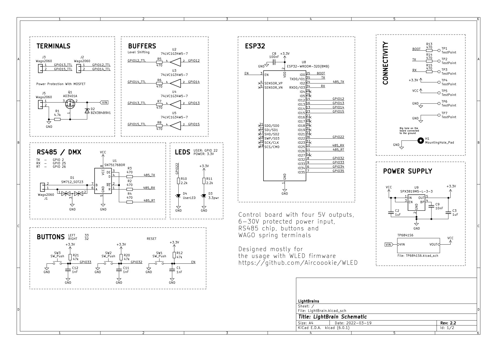
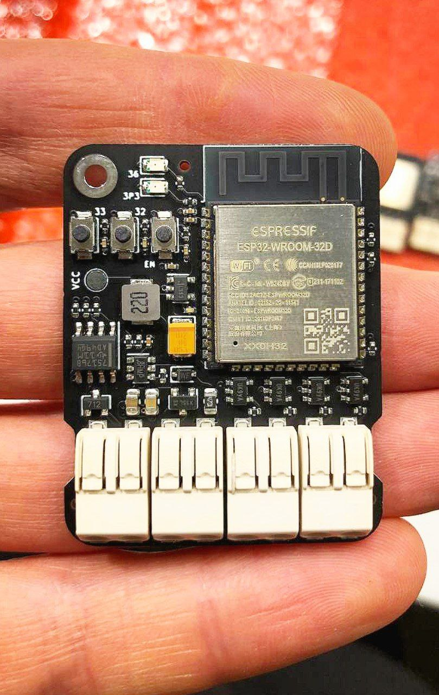
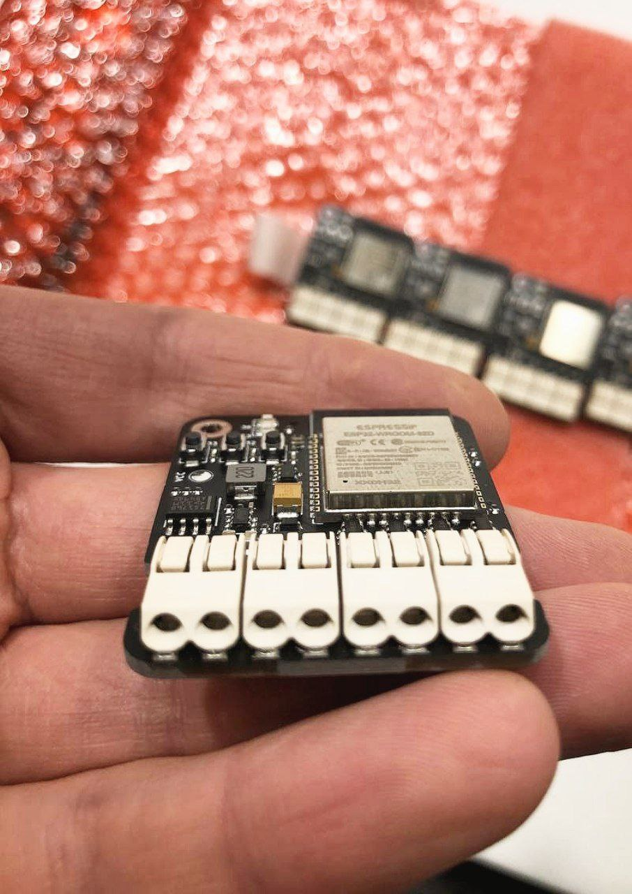
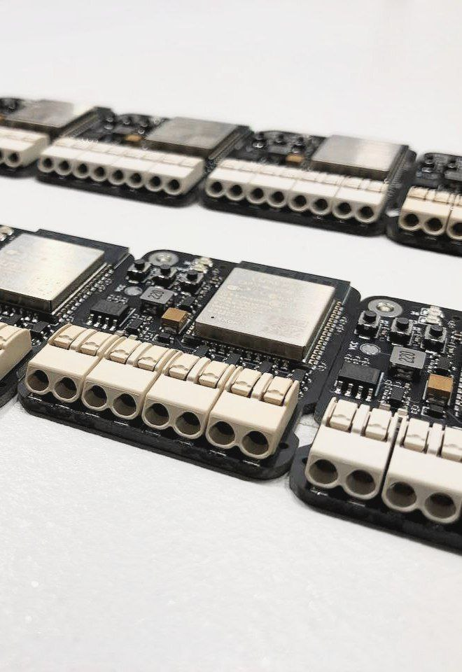

# LightBrain

## Overview

The initial motivation was to develop a compact and relatively versatile light control device. Communicating with colleagues interested in electronics, I made a few design decisions so that the functionality would meet a number of requests: wide power supply voltages, protection, buttons, DMX support, shifted ouputs.

* ESP32-WROOM module
* four level shifted outputs
* 6-30V protected power input
* RS485 chip (DMX Support)
* Convinent buttons and user LED
* Very handy WAGO spring terminals

 

## Usage

Designed mostly for the usage with [WLED firmware](https://github.com/Aircoookie/WLED) by [Aircookie](https://github.com/Aircoookie)

There is no USB=>UART bridge in design. This was done to make the design smaller and cheaper. In the future, a firmware device with pogopin will be made, but most likely there will be a revision of the entire design. WLED has OTA functionality which can be used in case of update the firmware.

The board comes with a few examples that I wrote to test the functionality of the board. I really like [micropython](https://micropython.org/), which works fine on these boards. Very handy for prototyping, the buttons and custom LED makes it interactive. Unfortunately, I never got around to running DMX with python. Then I wrote an example using the SparkFunDMX library, which works like a charm.

## Appearance and Examples

  

Illustration of working WLED:

https://user-images.githubusercontent.com/8849896/159166993-72adfaef-fdb5-461d-86bc-35848b8165a1.mp4

https://user-images.githubusercontent.com/8849896/159166995-e5065d50-ee23-4bfb-9fdf-d8251501cd79.mp4

https://user-images.githubusercontent.com/8849896/159166997-b3421e14-9344-47e1-aa16-2b2efedc7f29.mp4

Illustration of working DMX:

https://user-images.githubusercontent.com/8849896/159167005-f4b18b29-a19e-47f2-82c6-617aa11a5b83.mp4

