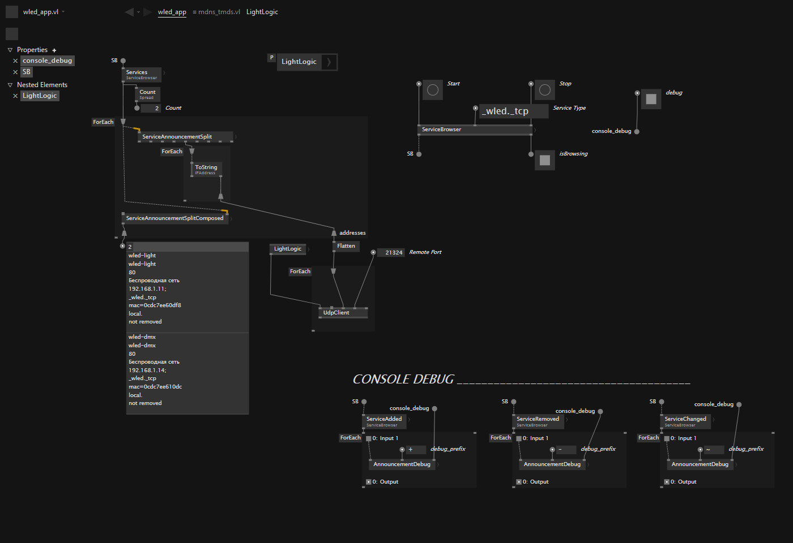

### VVVV

VVVV is a general-purpose development tool with visual language capabilities. It is not only a tool for rapid prototyping and developing interactive software, but also a complete IDE based on .NET and C# technologies.

It's a bunch of proof of concepts and ingredients for future projects.

You can learn more on the website:\
visualprogrammin.net

